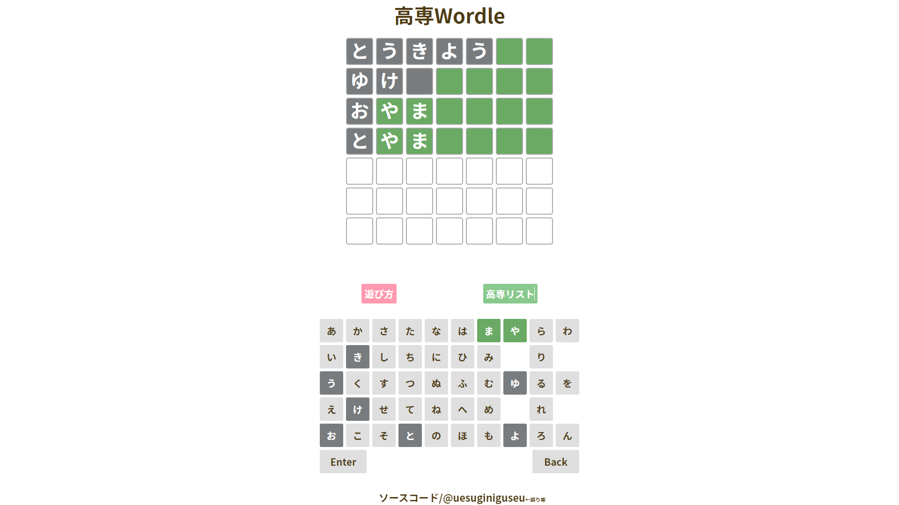
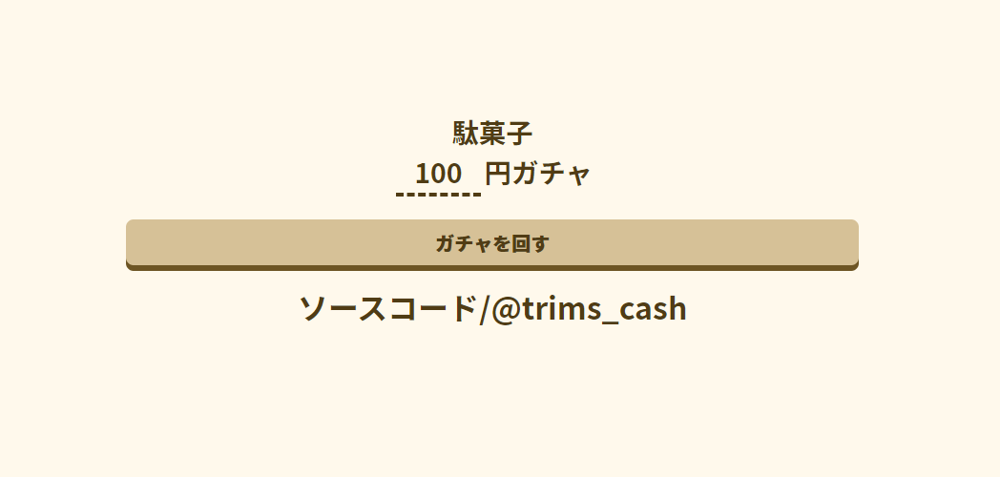
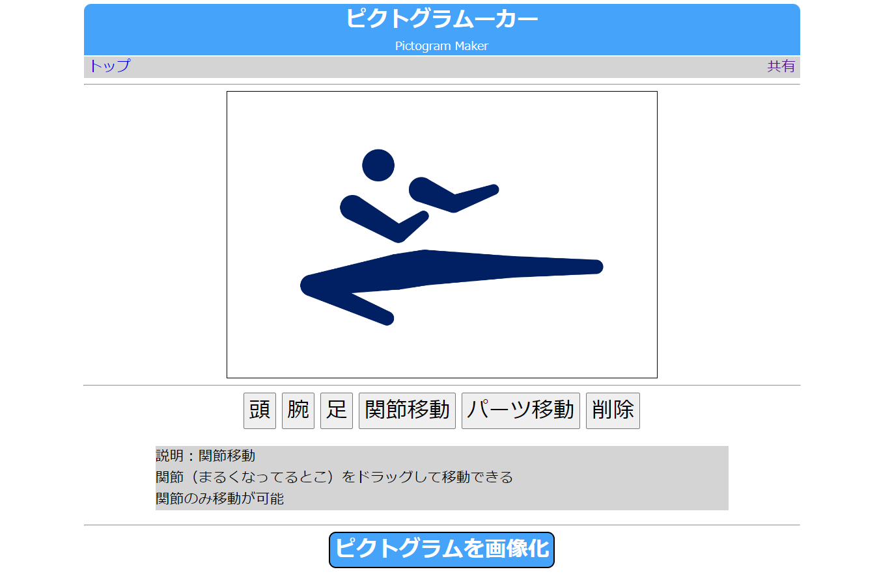
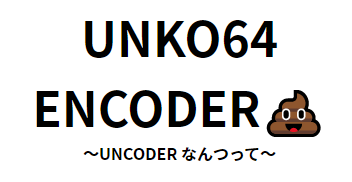
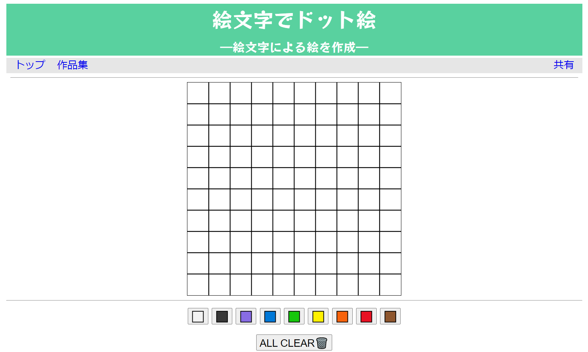
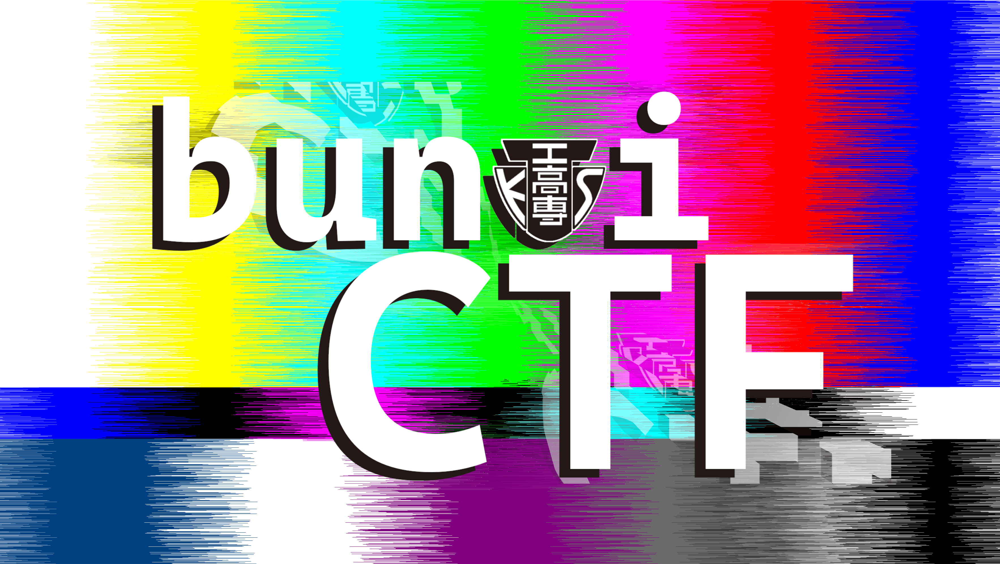

---
# the default layout is 'page'
icon: fas fa-info-circle
order: 4
---

## who
私がJK(情報工学科高専生)の[trimscash](https://twitter.com/trims_cash)です．

- 東京高専生
- 3年でいたいけどももう4年．
- 最近はCTFが趣味(pwn)
- 基本的になにもやってない

## 儂の`Qiita`

## いろいろ

 

### etc..

### github を見てね！！

### [TrimsCash --GitHub](https://github.com/trimscash)
